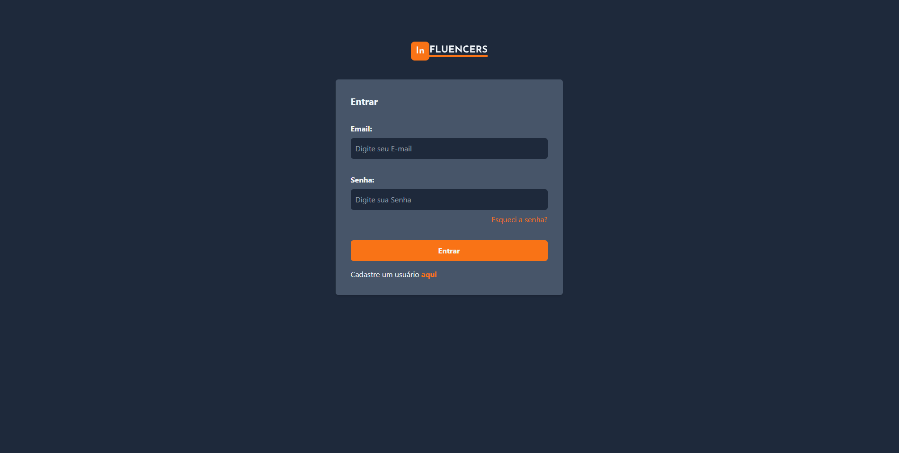

<div align="center">
  <h1 align="center">
    
    <br />
    <br />
    <div>
      
      
    </div>
  </h1>
</div>
<p align="center">
  
<p/>

## Tabela de Conteúdo
  
* [Tabela de Conteúdo](#tabela-de-conteúdo)
* [Introdução](#introdução)
* [Estrutura do Repositório](#estrutura-do-repositório)
* [Instalação](#instalação)
* [Tecnologias Utilizadas](#tecnologias-utilizadas)
* [Funcionalidades Implementadas](#funcionalidades-implementadas)
* [Funcionalidades para Implementar](#funcionalidades-para-implementar)
* [Screenshots](#screenshots)

## Introdução

InFluencers é um projeto voltado para treinar e  avaliar habilidades técnicas de um desenvolvedor(a) fullstack. Esse projeto conta.

**Projeto**: Plataforma de Engajamento de Influenciadores

**Descrição**: A plataforma conectará marcas a influenciadores digitais, facilitando parcerias e campanhas de marketing. Possuindo descriçoes detalhadas para cada nível de desenvolvimento (Júnior, Pleno e Sênior) em documentos separados.

**Objetivo**: Desenvolver plataforma de Engajamento de Influenciadores seguindo as Instruções para o nivel Pleno usando as seguintes Tecnologias: **Node.js** e **React.js**, respectivamente para o backend e frontend, combinadas com Typescript.


## Estrutura do Repositório

A raiz do repositório é composta por 3 páginas.
1. **.github** Página voltada para o workflow do repositório
2. **backend** Onde está localizado o backend do sistema feito em Node.js com Nest.js e Prisma de ORM. Aqui também está localizado o bando de dados em SQLite e arquivos como ```docker-compose.yml```.
3. **frontend** Onde está localizada a frente do sistema, feito em React.js com Typescript e Vite.

## Instalação
### Docker:
Se você estiver como rodar a aplicação em um container e tiver o Docker ou Docker Desktop funcionando em sua maquina, você pode rodar o arquivo ```docker-compose.yml``` localizado no backend da aplicação que será iniciado
a montagem de um ambiente isolado para experimentar a aplicação. Nesse caso, pode-se rodar o seguinte comando.

```
$ docker-compose up --build
```
**Importante**: Para evitar problemas com outros containers, busque deixar livre as portas 3000 e 5173 para a execução dos containers.
**Obs:** A versão do node utilizada para o desenvolvimento desse projeto foi: **Versão Node - v20.12.2.**

### Execução Local:
- **Backend**
  - Instale as dependências do projeto da forma que preferir. Em seguida, deve-se preencher as variáveis de ambiente em um ```.env```. Nesse caso, as mais complicadas são as ```JWT_PRIVATE_KEY``` e ```JWT_PUBLIC_KEY```, as quais são chaves privada e pública do tipo RSA256 em base64. Para gerar essas chaves, deve-se em Linux, executar as seguintes instruções:

    ```bash
    # Gerar private:
    $ openssl genpkey -algorithm RSA -out private_key.pem -pkeyopt rsa_keygen_bits:2048

    # Gerar public da chave privada:
    $ openssl rsa -pubout -in private_key.pem -out public_key.pem

    # Colocando em base64:
    $ base64 -w 0 private_key.pem > private_key-base64.txt 
    # e
    $ base64 -w 0 public_key.pem > public_key-base64.txt
    ```

    Em caso de dúvida, essas instruções encontram-se no ```.env.example``` do backend.

  - Em seguida, instale as dependências do projeto e prepare o Prisma.
```
$ npm install
$ npx prisma generate
$ npm run start:dev
```
 - Frontend
   - Para o frontend é muito mais simples. Basta instalar as dependências e colocar a URL da API do backend no ```.env```.
```
$ npm install
$ npm run dev

```
## Tecnologias Utilizadas

| Backend                      | Frontend                      |
|------------------------------|-------------------------------|
| Nest.js                      | React.js                      |
| Prisma                       | Tailwind                      |
| SQLite                       | Vite                          |
| passport                     | Shadcn UI                     |
| jwt                          | Radix UI                      |
| Algoritmo RSA 256            | Phosphor Icons React          |
| Typescript                   | ContextAPI                    |
| DTOs                         | react-router-dom-v6           |
| zod                          | react-hook-form               |
| bcryptjs                     | react-toastify                |
| throttler                    | Typescript                    |


**OBS** Optei por utilizar Next.js no projeto mas decidi por não por falta de tempo para estruturar páginas e visualizar como o código seria hidratado.
## Funcionalidades Implementadas
- Backend
  - [x] `Auth Modules`: Modulo e rotas para cuidar de autenticação do usuário, possuindo acessToken e RefrashToken.
  - [x] `Auth Guards`: Um guarda de autenticação para servir de "middlewere" para rotas selecionadas.
  - [x] `Passport JWT`: Estratégia de jwt aplicando passport para asegurar devida segurança das rotas.
  - [x] `Algorithm RSA256 para chaves`: Autenticação com chave pública e privada comum de jwt, utilização chaves privadas para a geração de conteúdo e chave pública para consumo.
  - [x] `User Module`: Modulo de rotas para usuário administrador .
  - [x] `Influencers Module`: Modulo de rotas para influenciadores, associando eles com categorias e marcas .
  - [x] `Brands Module`: Modulo de rotas para visualização das Marcas as quais são associadas com os influenciadores .
  - [x] `All exceptions filter`: Sistema de gerenciamento de exceptions generalizado vinculado com modulo de log. 
  - [x] `Logger Module`: Modulo de gereção e exibição de logs que pode ser exportado para arquivos .csv
  - [x] `ThrottlerModule`: Sistema de throttler para evitar inúmeras requisições em perídos vistos como curtos (1 segundos ) e longos ( 1 minuto ).
  - [x] `Docker`: Dockerização 
- Frontend
  - [x] `Auth Context`: Controle da autenticação via fontend.
  - [x] `Influencers Context`: Controle da influenciadores via fontend.
  - [x] `Brands Context`: Controle de Marcas via fronend.
  - [x] `Validação de Formulários não controlado`: Uso de formulários não controlados para melhor performace e validação de campos.
  - [x] `uso de Api de cep`: Consumo de API gratúita de CEP para melhor preenchimento de formulário de endereço.
  - [x] `Filtragem de Influenciadores por Marcas e Categorias`: Filtragem de lista de Influenciadores Vinculando suas categorías (nicho) e Marcas patrocinadoras.
  - [x] `Edição de Influenciadores`: Editar influenciadores existentes.
  - [x] `Consumo de Influenciadores`: Visualização de dados de influenciadores. 
  - [x] `Criação de Influenciadores`: Criação de novos influenciadores.
  - [x] `Deleção de Influenciadores`: Remoção de influenciadores.
  - [x] `Cadastro de usuários`: Cadastro de usuários administradores.*
  - [x] `Login`: Sistema de Login
  - [x] `Logout`: Sistema de Logout
  - [x] `Docker`: Dockerização 
 
- Outros
  - [x] `Workflow para repositório remoto`: 
## Funcionalidades para Implementar
  Embora tivese 7 dias para o desenvolvimento do projeto, acabei apenas conseguindo utilizar 4 dias devido a complicações. De toda forma, aqui estão algumas das partes que faltou implementar originalmente e algumas que gostaria de implementar.
 - [ ] Listagem de Marcas
 - [ ] Edição de Marcas
 - [ ] Criação de Marcas
 - [ ] Deleção de Marcas
 - [ ] Busca de Elemento searchbar
 - [ ] Parcerias de Influenciadores
 - [ ] Sistema de comentários ( semelhante ao Twitter/ X )
 - [ ] Hospedágem na AWS
 - [ ] Uso de Bucket para armazenamento e consumo de imagens
 - [ ] Implementações de Teste de frontend
 - [ ] Responsividade
 - [ ] Sistema de níveis para Influenciadores ( por tamanho de alcance ou interação )
 - [ ] Sistema de hierarquia para usuários 'admin' ( 'escritor', 'leitor', 'admin', etc )
 - [ ] Design mais elaborado para o site.
 - [ ] uso de PWA para a aplicação ser híbrida.
 - [ ] Dark / Light Theme


## Screenshots
<p width="100%">
  
  
  
  
</p>
